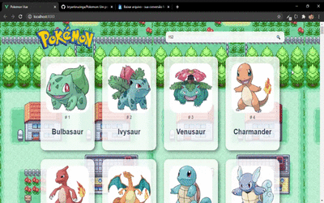

<h1 align="center">Pokedex em Vue JS</h1>

<h2 align="center">Projeto pessoal feito para praticar o uso de VueJS</h2>

<i>App em telas desktop</i>

Particularmente, foi um grande desafio, pois além de ser uma maneira de praticar o uso de VueJs, também foi a primeira vez que trabalhei com uma api tão volumosa quanto
essa.

É um simples projeto de uma pokedex que busca as informações de todos os Pokemóns (bons tempos em que eram só 150 rsrs) e retorna uma lista com esses pokémons,
  a lista é infinita, sempre carregando mais a medida que o usuário se aproxima do fim da lista (essa feature foi o resultado de muita pesquisa, pois a ideia era ter
  maior fluidez no uso do app).

  
O app é responsível e possui um sistema de busca que busca qualquer pokémon pelo nome ou seu número de identificação, como por exemplo o 25 buscará o Pikachu.

  

  
<i>App responsivo</i>

  
  
O app está disponível para vizualização 
  <a href="https://pokemon-sable.vercel.app/">aqui.</a>

  
  <h2>Para clonar e executar o projeto</h2>
 
Para executar o projeto, após fazer o <strong>Fork</strong> do projeto deve-se executar o npm para puxar os pacotes utilizados, então no bash ou qualquer linha de comando digite:

<code>npm install</code>

Agora pode executar o projeto com:

<code>npm run serve</code>
